# Activation Functions

An activation function is applied to a neuron's output to introduce **non-linearity** — allowing the network to learn complex patterns, not just straight lines.

## Why They Matter

- Without activation functions, every layer is just linear math. No matter how deep the network, stacking linear - layers only produces another linear function.
- Activation functions let the network **bend and curve** its decision boundaries to fit messy, real-world data.
- Matmul is purely linear math. Activation functions are what break that linearity, making depth actually useful.

---

## Types

### 1. ReLU — Rectified Linear Unit

Blocks negative signals, passes positive ones through unchanged.

```
f(x) = max(0, x)
```

| Input | Output |
|-------|--------|
| Negative | 0 |
| Positive | x |

**Used in:** Hidden layers — the default choice. Fast and works well in deep networks.

**Problem:** If a neuron always receives negative inputs, it always outputs 0 and stops learning — the **dying ReLU problem**.

---

### 2. Sigmoid

Squashes any number into the range **(0, 1)** — useful for probabilities.

```
f(x) = 1 / (1 + e⁻ˣ)
```

| Input | Output |
|-------|--------|
| Large positive | ~1 |
| Large negative | ~0 |

**Used in:** Output layer for **binary classification** (yes/no, spam/not spam).

**Problem:** For very large or very small inputs, the gradient approaches zero — weights stop updating. This is the **vanishing gradient problem**.

> **Vanishing gradient:** When the gradient is nearly zero, backpropagation has nothing to adjust — learning stalls.

---

### 3. Tanh — Hyperbolic Tangent

Like Sigmoid but centered — squashes into **(-1, 1)**.

```
f(x) = (eˣ - e⁻ˣ) / (eˣ + e⁻ˣ)
```

| Input | Output |
|-------|--------|
| Large positive | ~1 |
| Large negative | ~-1 |
| Zero | 0 |

**Used in:** Hidden layers when zero-centered outputs matter — generally outperforms Sigmoid in hidden layers.

**Problem:** Still suffers from the vanishing gradient problem, just less severely than Sigmoid.

---

### 4. Softmax

Converts a group of numbers into **probabilities that sum to 1**. The largest number gets the highest probability.

```
f(xᵢ) = eˣⁱ / Σeˣ
```

**Example:** Raw outputs `[2.0, 1.0, 0.5]` → Softmax → `[0.60, 0.30, 0.10]`
Meaning: 60% cat, 30% dog, 10% bird.

**Used in:** Output layer for **multi-class classification** (more than 2 categories).

**Key difference:** Softmax operates across all outputs at once, not neuron by neuron. Never used in hidden layers.

---

## Quick Reference

| Function | Output Range | Used In | Main Problem |
|----------|-------------|---------|--------------|
| ReLU | [0, ∞) | Hidden layers | Dying ReLU |
| Sigmoid | (0, 1) | Binary output | Vanishing gradient |
| Tanh | (-1, 1) | Hidden layers | Vanishing gradient (mild) |
| Softmax | (0, 1), sums to 1 | Multi-class output | — |




---

## Deep Dives

### Vanishing Gradient Problem

During backpropagation, gradients flow backwards through every layer to update weights. Sigmoid and Tanh both squash their outputs into a small range (0→1 and -1→1). When you take the gradient of these functions, the values become very small — often less than 0.25.

Now multiply that small gradient across many layers — it gets smaller and smaller until it's nearly zero by the time it reaches the early layers. Those layers stop learning because there's nothing meaningful to update.

That's why **ReLU is preferred in deep networks** — its gradient is either 0 or 1, so it doesn't shrink as it flows back.

| Function | Gradient Range | Vanishing Risk |
|----------|---------------|----------------|
| Sigmoid | (0, 0.25) | High |
| Tanh | (0, 1) | Moderate |
| ReLU | 0 or 1 | None |

---

### Dying ReLU Problem

ReLU outputs 0 for any negative input. If a neuron consistently receives negative inputs, it always outputs 0 — and a gradient of 0 means weights never update. The neuron is **permanently dead**.

**Fix → Leaky ReLU**

Instead of outputting flat 0 for negatives, it outputs a tiny slope:

```
f(x) = x        if x > 0
f(x) = 0.01x    if x ≤ 0
```

So negative inputs still produce a small signal — enough to keep the neuron alive and learning.
