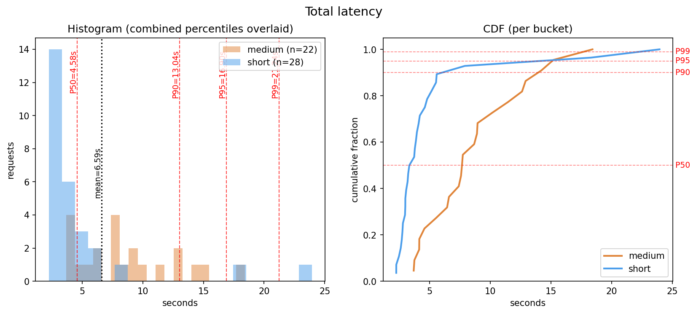
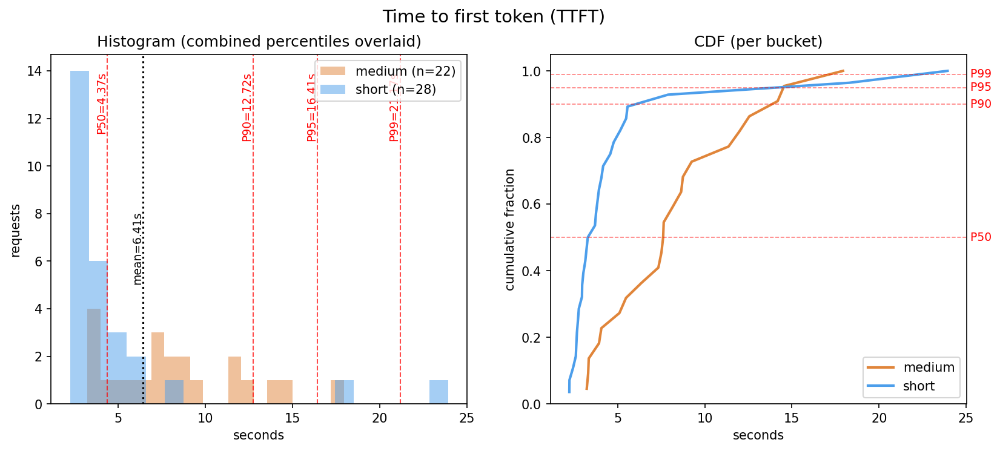

# LLM Performance Metrics — Hands-on

Send a bucketed mix of prompts to a free OpenRouter model, measure TTFT and total latency per request, and plot the P50/P90/P95/P99 percentiles.

Companion to [../llm_performance_metrics.md](../llm_performance_metrics.md).

## Layout

```
llm-performance-metrics/
├── prompts/
│   ├── short.md      # 33 short factual questions
│   └── medium.md     # 33 paragraph + summarize prompts
├── measure.py        # sends requests, writes results.csv
├── visualize.py      # reads results.csv, plots histograms + CDF
├── requirements.txt
├── .env.example
└── .gitignore
```

## Setup

1. Get a free API key at [openrouter.ai](https://openrouter.ai).

2. Create and activate a virtual environment (run from this folder):

   **Windows (PowerShell):**
   ```
   python -m venv .venv
   .venv\Scripts\Activate.ps1
   ```

   If PowerShell blocks the activation script, run this once for the current session:
   ```
   Set-ExecutionPolicy -Scope Process -ExecutionPolicy Bypass
   ```

   **macOS / Linux:**
   ```
   python3 -m venv .venv
   source .venv/bin/activate
   ```

   Your prompt should now show `(.venv)`. To leave the venv later, run `deactivate`.

3. Install dependencies (inside the activated venv):
   ```
   pip install -r requirements.txt
   ```

4. Create a `.env` file in this folder and add your OpenRouter API key:
   ```
   OPENROUTER_API_KEY=sk-or-v1-...
   ```

## Run

**Collect data** (~1–2 min for 66 requests):

```
python measure.py
```

Live output looks like:

```
[14/66] bucket=short ttft=180ms total=820ms tokens=22
[15/66] bucket=medium ttft=210ms total=2340ms tokens=180
```

When it finishes, `results.csv` contains one row per request.

**Visualize:**

```
python visualize.py
```

Prints a percentile summary table and opens two plot windows. Both are also saved as PNG files in this folder:

- `total_latency.png` — distribution of end-to-end response times
- `ttft_latency.png` — distribution of time-to-first-token

Each plot shows a histogram with P50/P90/P95/P99 lines on the left and a CDF on the right.

### Output

Here's the output from a sample run:

```
bucket     metric       n  mean(s)      P50      P90      P95      P99      max
----------------------------------------------------------------------------
medium     ttft        22     8.29     7.63    14.02    14.53    17.22    17.93
medium     total       22     8.66     7.69    14.08    15.15    17.75    18.42
short      ttft        28     4.93     3.50     6.27    14.65    22.41    23.93
short      total       28     4.95     3.51     6.27    14.65    22.42    23.95
----------------------------------------------------------------------------
```

### What the percentiles mean (using the numbers above)

| Percentile | In plain English | Example from this run |
|------------|------------------|-----------------------|
| **P50** | The typical experience — half of requests were faster, half slower. | Short prompts: half got a response in under **3.5s** |
| **P90** | 9 in 10 requests were faster than this. The slowest 1 in 10 crossed this line. | Short prompts: 1 in 10 waited over **6.3s** |
| **P95** | 19 in 20 were faster. The unlucky 1 in 20 waited longer. | Short prompts: 1 in 20 waited over **14.7s** — nearly 4× the median |
| **P99** | Only 1 in 100 were slower. Rare, but real. | Short prompts: worst 1% waited over **22.4s** — 6× the median |

The key insight: the **mean (8.29s for medium TTFT) hides the full picture**. The median is 7.6s but P99 hits 17.2s — that's more than double. Averages look fine; percentiles show who's actually suffering.

### Plots

Total latency distribution:



Time to first token (TTFT) distribution:



## Tweaking

Knobs are constants at the top of `measure.py`:

- `MODEL` — try a different free-tier or paid model.
