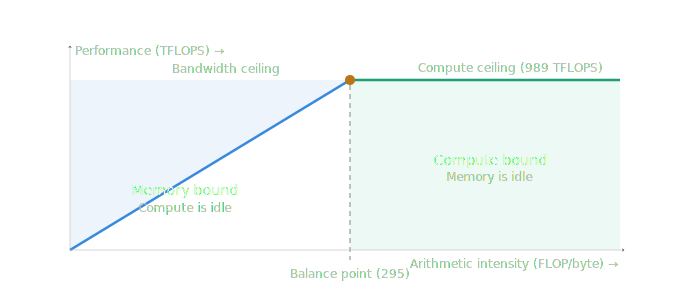

## Inference System Bottlenecks

- LLM prefill (KV cache construction) -> compute-bound
- LLM decode (token generation) -> memory-bound
- Image and video generation -> compute-bound

## Optimization: Batching

- Instead of one request at a time, batch multiple requests together
  - Model weights are loaded into memory once for the whole batch
  - For memory-bound workloads: one token generated per request per forward pass, but memory cost is amortized
  - For compute-bound workloads: matrix multiplications run simultaneously across all requests

## GPU Balance Point (Ops:Byte Ratio)

For each GPU:
- Compute speed -> measured in FLOPS (floating point operations per second)
- Memory bandwidth -> measured in GB/s or TB/s (data transfer speed between VRAM and compute cores)

Definitions:
- VRAM -> stores model weights, activations, KV cache
- Compute cores -> execute matrix calculations

Calculate ops:byte ratio:
- ratio = peak compute / memory bandwidth

Example: H100 (FP16)
- peak compute = 989 TFLOPS
- memory bandwidth = 3.35 TB/s
- ratio = 989 / 3.35 = 295 FLOP/byte

The ratio means: for every byte loaded from VRAM, the GPU must do 295 FLOPs to keep both fully utilized.
- fewer than 295 ops/byte -> memory-bound (compute sits idle waiting for data)
- more than 295 ops/byte -> compute-bound (memory sits idle waiting for work)
- exactly 295 ops/byte -> perfectly balanced

## Arithmetic Intensity

- Arithmetic intensity = ops / bytes for a specific algorithm (not the hardware)
- Use it to determine whether a workload is memory-bound or compute-bound

Roofline model:

