# Matrix Multiplication

Matrix multiplication (matmul) is when two grids of numbers combine to produce a new grid. Each output value equals a row from the first matrix dotted with a column from the second.



Each output cell = multiply element by element across a row and column, then sum.

> **Note:** The inner dimensions must match — a (2×3) matrix can only multiply a (3×anything). The result's shape equals the outer dimensions — (2×2) here.

## How Matmul Is Used in Neural Networks

In a neural network, every forward pass is essentially a series of matrix multiplications. Each layer's operation is:

```
Output = Input × Weights + Bias
```

That's it. "Passing data through a layer" is just matmul.



## Why Matmul Matters

**1. It processes all samples at once** — instead of computing one input at a time, matmul handles the entire batch simultaneously. That's what makes GPUs powerful for training — they're built for parallel matrix operations.

**Why GPUs?**
- A CPU excels at doing one complex task at a time.
- A GPU has thousands of smaller cores designed to do many simple calculations simultaneously.

Since matmul is a massive amount of multiply-and-add operations, the GPU can compute all of them in parallel — making training dramatically faster than a CPU ever could.

**2. Every layer is a matmul** — as data flows forward through the network, it's just `Input × Weights + Bias`, repeated layer after layer.

**3. Weights are the matrix** — when the network "learns," it's updating the numbers inside the weight matrices until the outputs become accurate.

**4. Backpropagation is also matmul** — when adjusting weights during training, gradients flow backwards through the same matrices using transposed matrix multiplication.

---

In short — a neural network is a pipeline of matrix multiplications, and training is the process of finding the right numbers to fill those matrices.
