# Neural Networks

A neural network is a collection of nodes (neurons) organized in layers, connected to each other by weighted connections. Data flows forward through the network to produce a prediction, and errors flow backward to improve it.



## Architecture

Three layer types work together in sequence:

- **Input layer** → receives raw data
- **Hidden layers** → extract patterns and representations
- **Output layer** → produces the final prediction

## Forward Pass

Data flows through the network layer by layer. Inside every neuron, the computation is:

```
output = (input₁ × weight₁) + (input₂ × weight₂) + ... + bias
```

That result then gets passed through an **activation function**, which decides whether and how strongly the neuron fires.

## Weights and Biases

- **Weight** — how much importance to give each incoming signal. A high weight means "this input matters a lot"; a low weight means "mostly ignore this."
- **Bias** — a fixed offset that shifts the output up or down, independent of the input. It lets the neuron activate even when all inputs are zero, giving the network more flexibility.

## Training: Backpropagation

After a forward pass, the network measures its error (how wrong the prediction was). Backpropagation uses that error to nudge weights and biases slightly:

- **Weights** adjust which inputs matter
- **Biases** adjust the baseline threshold

Over millions of iterations, they settle into values that make the network accurate.
